# revive-fitness
## Milestone Project 1
### <u>About the Project</u>
This project creates a simple website for Revive Fitness, where it offers all you need to know about the company and their gym, whether it's regarding the company, or their class schedule. With their social media platform link at the bottom of the page, you will never miss any news or updates that is relevant to Revive Fitness gym. The aim for this website is to advertise the gym and the memberships while also encouraging people to work out at Revive Fitness.

### <u>About Revive Fitness</u>
Revive Fitness is a fast growing gym based in Manchester, England. Founded by three fitness and bodybuilder instructors, they discovered how expensive gym memberships are in Manchester and wanted to make a difference so that everyone could get fit regardless of their finances. They all had a website created and to spewad the word about their affordable gym prices and also for people to connect, share their goals and to encourage one another to acheive their dreams and make new friends along the way.

### <u>Design </u>
The website is designed as one full page that has been split into sections. The four sections within the page has an easy access, they can click on the section they would like to view and they would be taken to the section. The colours I used for the website are: 

### <u>Hosting </u>
I hosted my project using Github which was linked to my Visual Studio Code.

I created the Revive Fitness repository on Github. I then created the HTML and CSS index page, then copied and pasted into the command line:  
`echo "# test" >> README.md`  
`git init`  
`git add README.md` 
`git commit -m "first commit"` 
`git branch -M main` 
`git remote add origin https://github.com/bryonybailey485/test.git` 
`git push -u origin main` 

This linked the github repository to the Visual Studio index pages. I could then easily make changes to my project, then commit and push the new version of my project to github by using:  
`git add .` 
`git commit -m "Updates or changes made"` 
`git push` 
Within the commit message, I would note every change or deletion that I made to the project, then I would use git push to push the updated version of the project to the gitgub repository.

## <b><u>Mobile Version</u></b> 

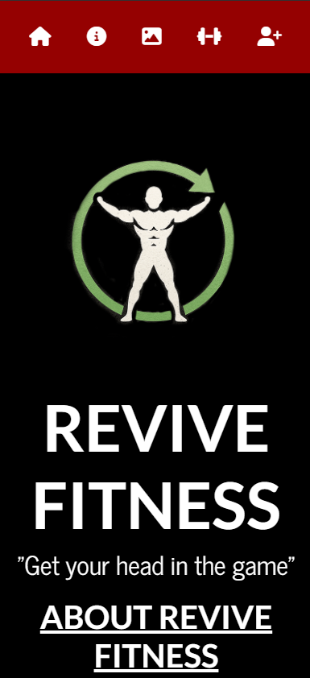

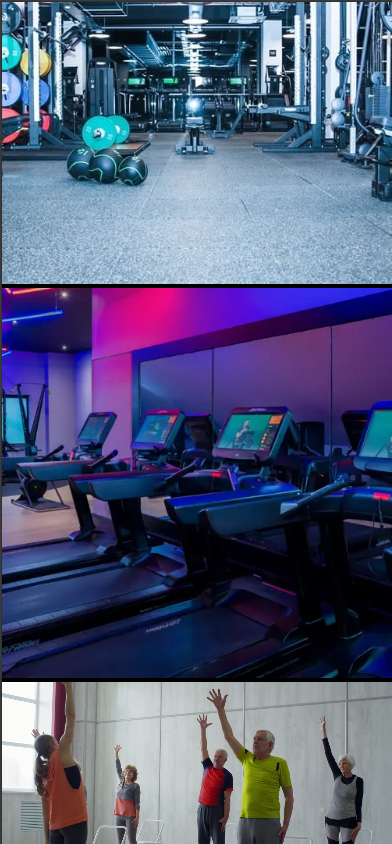

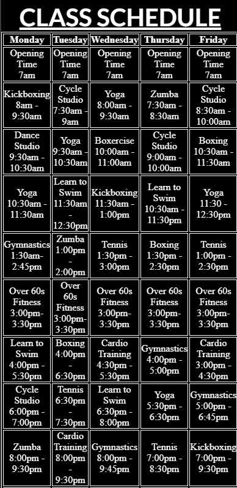

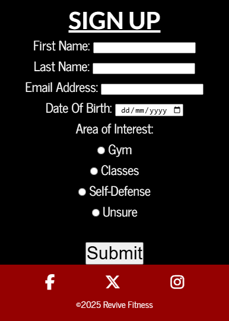

## <b><u>Tablet Version</u></b> 
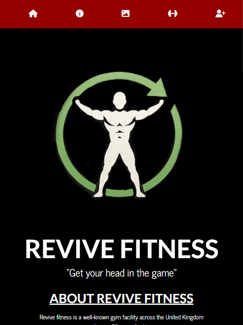

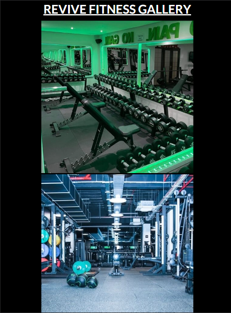

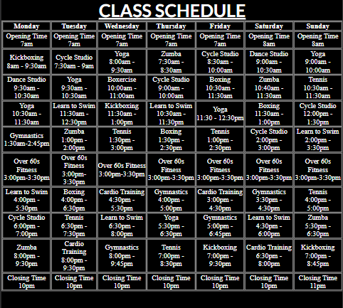

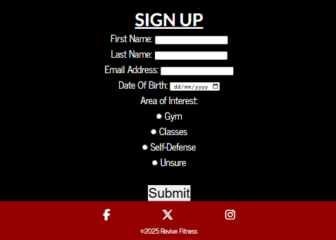

## <b><u>Desktop Version</u></b> 
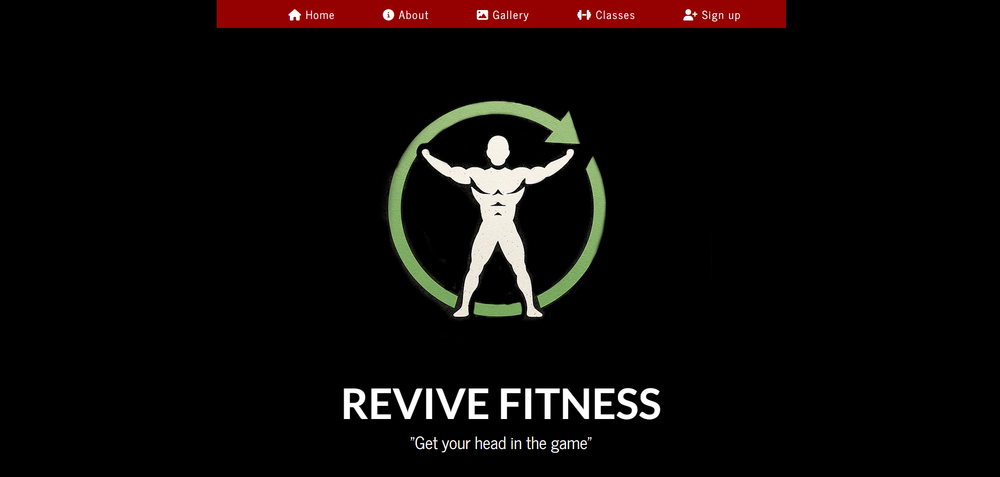

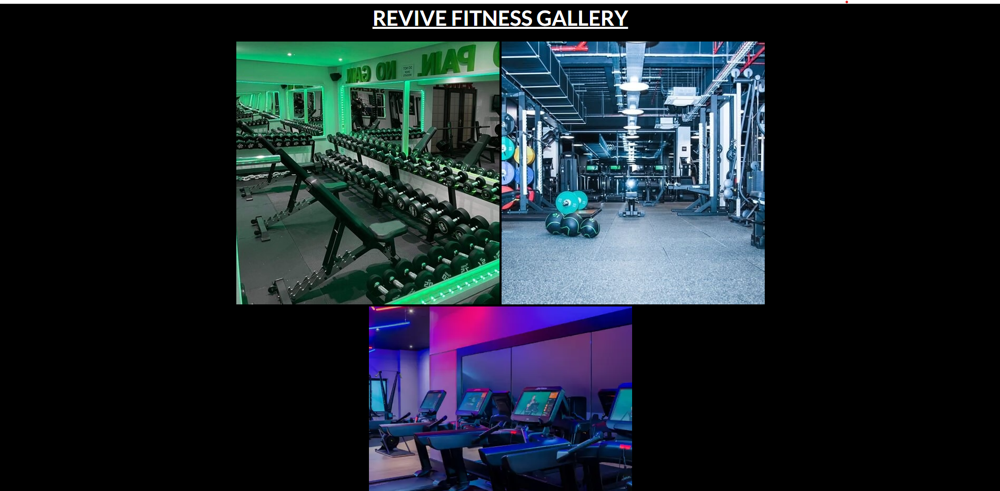

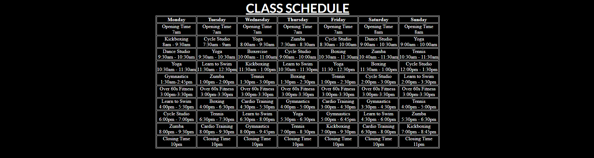

## <b><u> Code Validation </u></b>
### CSS Validation
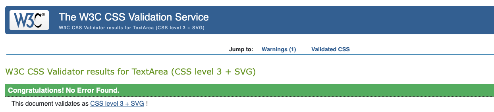
### HTML Validation
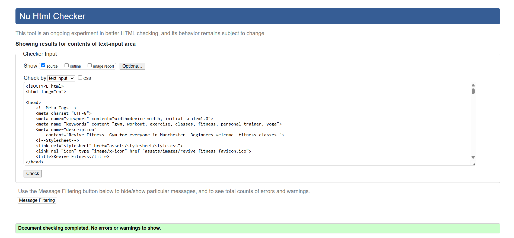

## <b><u> Lighthouse Test </u></b>
### Mobile Lighthouse

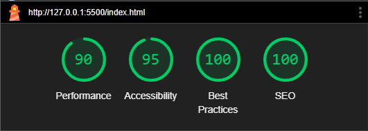
### Desktop Lighthouse
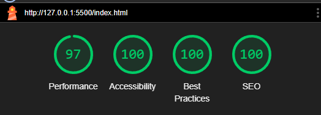

## Credits And References
Throughout the project I used code snippets from Code Insitute's Love Running Project, W3schools.com and Code Insitute Mentor.

